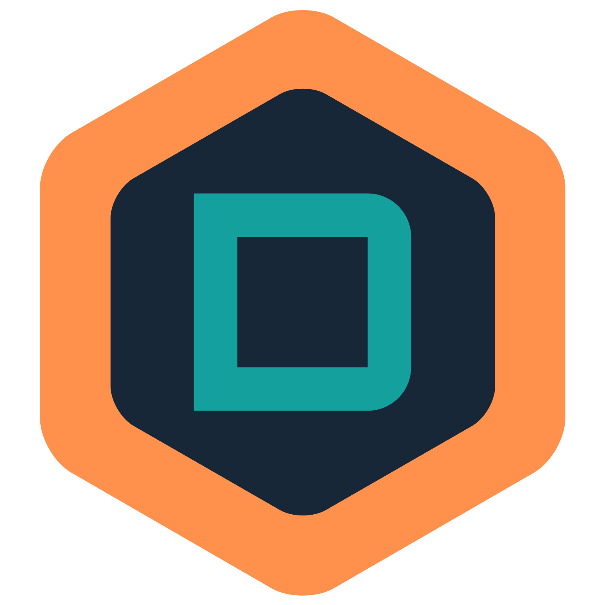

<div align="center">



<h1>Stakingdata.io</h1>

**This is a Ping.pub fork that has wallet connections removed and therefore, a good option for the US-based validators.**

[](https://github.com/ping-pub/explorer/releases/latest)
[](https://github.com/ping-pub/explorer/blob/master/LICENSE)
[](https://github.com/ping-pub/explorer/actions/workflows/mainnet-deploy.yaml)
[](https://twitter.com/decaliio)


</div>

Stakingdata.io is a light explorer for Cosmos-based blockchains. 

## What is the difference between Stakingdata.io explorer and other explorers? 

`Stakingdata.io` is designed to explore blockchain data as real as possible, therefore there is no cache, no pre-processing. The explorer only fetch data from Cosmos full node via LCD/RPC endpoints. Ping.pub calls it a "Light Explorer".

## Do you want to list your blockchain on Ping.pub?

Please submit your pull request [here](./src/chains). Ping.pub will add your chain as soon as possible. It is FREE, and Ping.pub states that they remain neutral to all chains, and they do not comment on the market prospects, technical risks, or investment risks. The only condition for listing on Ping.pub is that the chain has ten validators, and Ping.pub cannot determine if these validators are controlled by the same entity.

## Why Stakingdata/Ping explorer use official/trusted third party public LCD/RPC server?

There are two main reasons:

Trust, in a decentralized system, anything controlled by one entity cannot be trusted. So Ping.pub decided to build with the community.
Limited resources: `Ping Dashboard` will list hundreds of cosmos-based blockchains in the future, and it is impossible for the Ping.pub team to run validators or full nodes for all of them.


## Donation

Your donation will help Ping.pub make better products. Thanks in advance.

 - Address for ERC20: USDC, USDT, ETH
```
0x88BFec573Dd3E4b7d2E6BfD4D0D6B11F843F8aa1
```

 - You can donate any token in the Cosmos ecosystem: [here](https://ping.pub/coffee)

> If you are an individual please do not donate more than $10, a cup of coffee means a lot to us.

#### Donations from project

- Point Network: 1000USDC and $1000 worth of POINT
- Bitsong: 50k BTSG
- IRISnet: 100k IRIS

## Hire us

You can hire Ping.pub by submiting an issue and fund the issue on [IssueHunter](https://issuehunt.io/r/ping-pub/explorer)


## Contributors

Developers: @liangping @dingyiming | This fork is developed by @cosmosscanner and hello@decali.io

